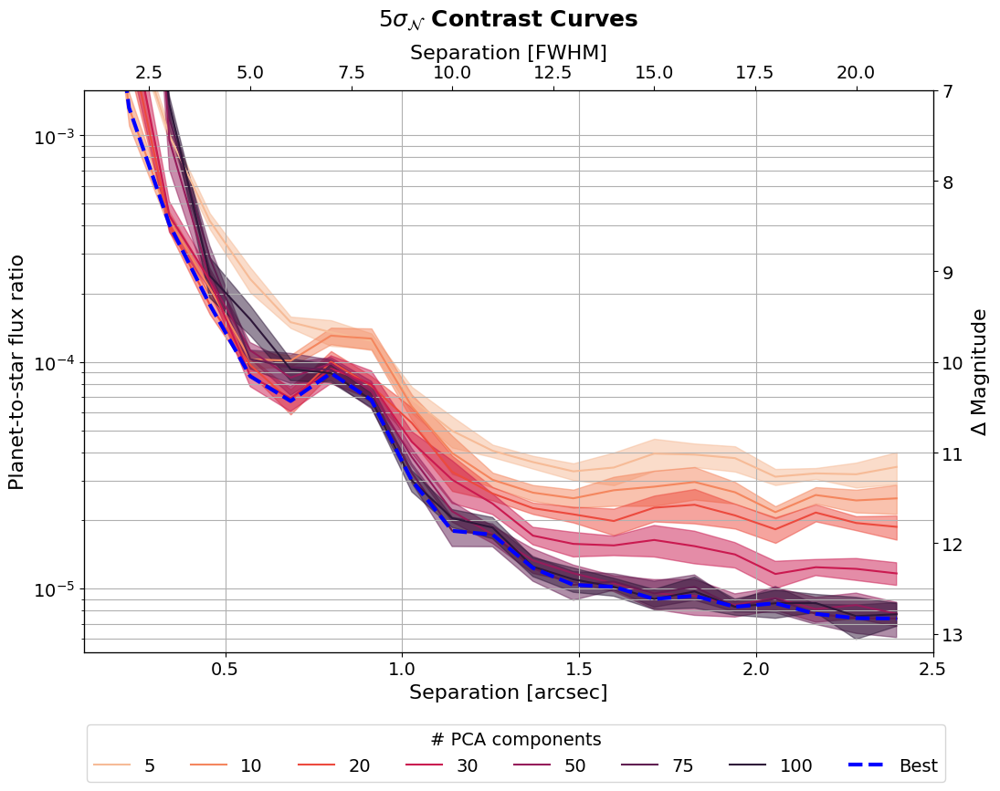

Welcome to applefy
==================

This is the documentation of ``applefy``, a Python package for calculating 
detection limits for exoplanet high contrast imaging (HCI) datasets. In this
documentation, we explain the how to use the package and provide some guides to
help you `get started <01_getting_started.rst>`_. We further provide the code to
`reproduce the plots <04_apples_with_apples/01_general.rst>`_ in Bonse et al. (subm.).

We have done our best to follow best practices for software development and
document all important steps. However, the code is still experimental.
If you encounter any difficulties, don't hesitate to contact us for assistance.

Please read the section about `Citation <05_citation.rst>`_ if you use applefy.

Contrast Curves
---------------
Applefy provides a number of features and functionalities to improve the accuracy
and robustness of contrast curve calculations. Here is an example of some
`contrast curves <02_user_documentation/02_contrast_curves.ipynb>`_ calculated with applefy using the
t-test discussed in `Mawet et al. 2014 <https://arxiv.org/abs/1407.2247>`_.

Non-Gaussian noise
------------------

One of the key strengths of ``applefy`` is its ability to
`handle non-Gaussian residual noise <04_apples_with_apples/paper_experiments/05_Parametric_BS_Procedure.ipynb>`_
through **parametric bootstrapping**. Residuals from ground-based
HCI observations are often limited by speckle noise. Even after using advanced 
post-processing algorithms, this speckle noise often deviates from Gaussian noise. 
Especially close to the star, the noise is often better described by Laplacian 
than by Gaussian noise. With ``applefy`` you can easily change the assumed 
noise distribution.

.. raw:: html
   :file: _static/para_bootstrap.html

Contrast Grids
--------------

Another key feature of the package is the option to compute
`contrast grids <02_user_documentation/03_contrast_grid.ipynb>`_:
A new way to explore which planets are detectable given their planet-star 
flux ratio and separation from the star. Here is an example of an interactive
contrast grid.

.. raw:: html
   :file: _static/contrast_grid_animation.html

**Click on the GIF animation to load the interactive version of the plot (~70 MB)**

.. toctree::
    :maxdepth: 2
    :hidden:
    :caption: Basics

    01_getting_started

.. toctree::
    :maxdepth: 2
    :hidden:
    :caption: User Documentation

    02_user_documentation/01_contrast_curves.ipynb
    02_user_documentation/02_contrast_grid.ipynb
    02_user_documentation/03_bootstrapping.ipynb

.. toctree::
    :maxdepth: 3
    :hidden:
    :caption: Package

    03_package/detections
    03_package/gaussianity
    03_package/statistics
    03_package/wrappers
    03_package/utils

.. toctree::
    :maxdepth: 2
    :hidden:
    :caption: Publications

    04_apples_with_apples/01_general

.. toctree::
    :maxdepth: 2
    :hidden:
    :caption: About

    05_citation